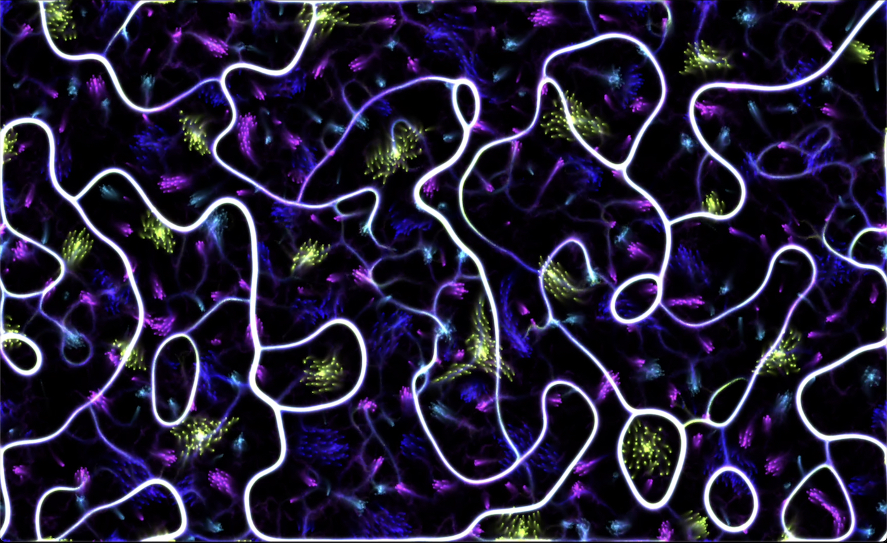

# Tölvera

- Tölvu = computer, from tala (number) + völva (prophetess)
- Vera = being
- Tölvera = number being

Part of the Agential Scores project https://iil.is/research/agential-scores

Demo videos: https://www.youtube.com/playlist?list=PL8bdQleKUA1vNez5gw-pfQB21Q1-vHn3x



## 'Beings'

For now, the `verur` (beings) are under their own namespace:

```sh
tolvera
    vera
        boids
        physarum
        etc
```

So you can do for example:

```py
>>> import tolvera as tol
[Taichi] version 1.2.2, llvm 10.0.0, commit 608e4b57, osx, python 3.10.5
>>> tol.vera.Boids
<class 'tolvera.vera._boids.Boids'>
```

See individual source files for code credits.

## Install

Like all packages in this repository, this one shares a `conda` environment with the rest of `iil-python-tools`:

```py
git clone git@github.com:Intelligent-Instruments-Lab/iil-python-tools.git
cd iil-python-tools
conda env create -f environment.yml
conda activate iil-python-tools
pip install -e tolvera
```

If on macOS, you should install the Vulkan graphics environment in order to use Taichi locally: https://vulkan.lunarg.com/sdk/home.

## Usage

See `./examples/tolvera/`

### CLI

Running the module directly can display examples:

```py
python -m tolvera help # list of possible examples
python -m tolvera boids # display the Boids example
```

### Live coding 

Live coding can be achieved via:
- [Sardine](https://github.com/Bubobubobubobubo/sardine)
- Via custom OSC protocols connecting to your live coding tool of choice.
- [jurigged](https://github.com/breuleux/jurigged)

#### via Sardine

- Create a `@swim` function to act as a `taichi.ui.Window` loop with a sufficiently high repeat rate, e.g.:
```py
c.link()
c.bpm=250
@swim
def gui_loop(d=0.5, i=0):
    boids.update()
    canvas.set_image(boids.world.to_numpy().astype(np.uint8))
    window.show()
    a(gui_loop, d=1/16, i=i+1)
```
- Create other `@swim` functions at lower speeds to update the parameters, e.g.:
```py
@swim
def param_loop(d=16, i=0):
    boids.max_speed[None] = P('2*sin($/2)')
    a(param_loop, d=8, i=i+1)
```

#### via OSC 

TidalCycles live coding over OSC example:

- Setup a `gui_loop` using Sardine as above, or using `iipyper`, or other event loop of choice.
- Create a Tidal OSCTarget for your needs. See `examples/tolvera/tidal/Lenia.hs` for an example.
- Create OSC handlers in Python via Sardine/`iipyper`/etc. See `examples/tolvera/lenia_iipyper_tidal.py` or `examples/tolvera/lenia_sardine.py`.

#### via `jurigged`

- In the module source file, create a function that will be called inside `while window.running`, for example:

```py
def main():
    ti.init(arch=ti.vulkan)
    resx = 1920
    resy = 1080
    n = 8192
    boids = Boids(resx, resy, n)
    window = ti.ui.Window("Boids", (resx, resy))
    canvas = window.get_canvas()
    while window.running:
        boids.update()
        update(boids)
        canvas.set_image(boids.world.to_numpy().astype(np.uint8))
        window.show()

def update(b):
    b.max_speed[None] = 10.0
```

Now when the file is modified and saved, whatever is inside `update()` will be updated.

### OSC in/out

See Sardine and `iipyper` examples.

## Roadmap

Completely exploratory at the moment. Collaborations/contributions welcome.

In no particular order...

- [ ] Standardise `vera` fields and param update methods
- [ ] Standardise OSC in/out
- [ ] Explore and compare performance between `sardine`, `sc3` and `iipyper`
- [ ] Add world-level features/functions such as membranes
- [ ] Enable separate `vera` to interact and move between membranes
- [ ] Saving/loading world states
- [ ] Direct manipulation of the world/`vera`
- [ ] See if compilation via Nuitka is possible
- [ ] Test on SBCs like Jetson Nano, Raspberry Pi, etc
- [ ] Explore TidalCycles Vortex integration
- [ ] Explore `taichi.js` x Svelte version
